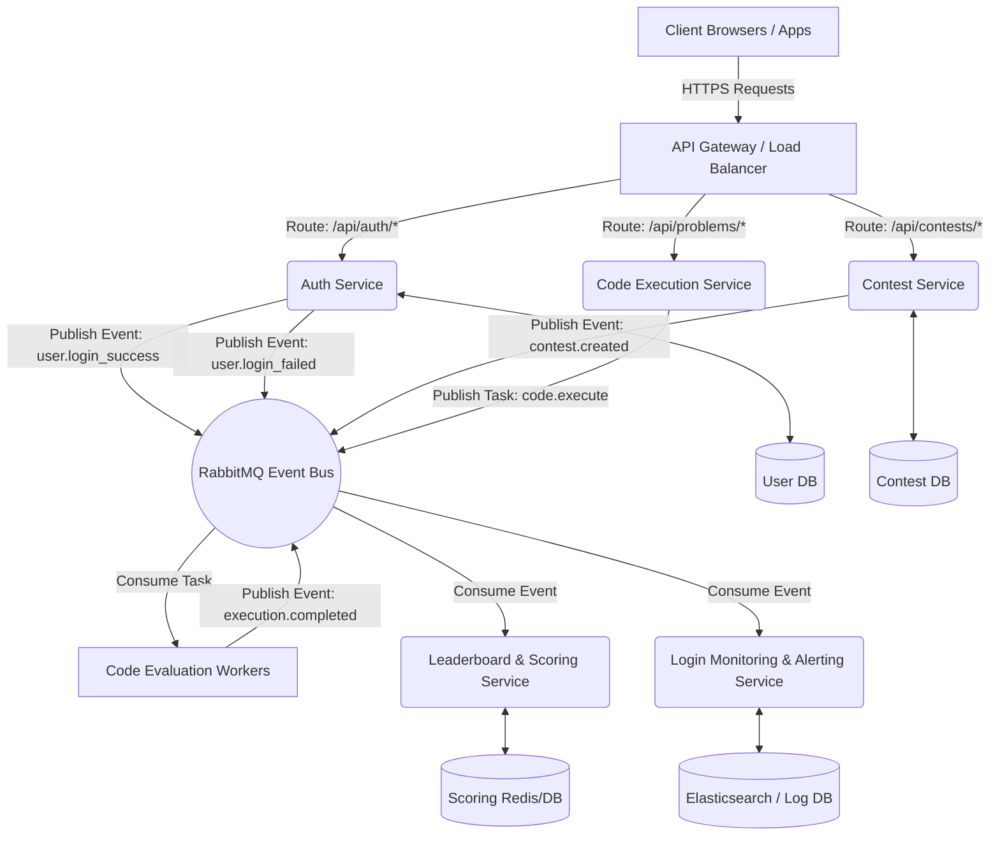

# Scalable Contest Platform Architecture

This document describes how the monolithic Contest Platform can be refactored into a scalable, asynchronous, and reliable ecosystem utilizing a **Microservices Architecture**, an **API Gateway**, and **RabbitMQ** for message brokering, with dedicated emphasis on **Login & Security Monitoring**.

## 1. High-Level Architecture Diagram

---

## 2. Core Components

### A. API Gateway
The API Gateway (e.g., Kong, NGINX, AWS API Gateway) acts as the single entry point into the system.
* **Routing & Orchestration:** It securely routes incoming requests (`/auth`, `/contests`, `/problems`) to their respective isolated microservices.
* **Rate Limiting & Throttling:** Crucial during high-traffic contests to prevent abuse (e.g., stopping users from spamming submissions).
* **JWT Validation:** Validates JSON Web Tokens at the edge so that backend microservices only receive pre-authenticated requests.

### B. Microservices
Breaking the monolith into specialized, independently scalable services:
1. **Auth Service:** Dedicated entirely to registration, JWT generation, and hashing.
2. **Contest Service:** Manages the CRUD operations for Contests, MCQs, and DSA configurations.
3. **Leaderboard Service:** Highly read-optimized (potentially using Redis) service responsible for calculating and serving rankings instantly without bogging down the main database.
4. **Code Execution Service (The Submission Handler):** Validates incoming code submissions and delegates the heavy lifting to RabbitMQ.

### C. RabbitMQ (Message Broker)
RabbitMQ acts as the resilient messaging backbone of the architecture. Instead of services calling each other synchronously (which can lead to cascading failures), they communicate asynchronously.
* **Code Execution Queue:** When a user submits code, the `Execution Service` pushes a `code.execute` message into RabbitMQ and immediately responds `202 Accepted` to the user. Remote Sandboxed **Evaluation Workers** pick up the message, run the test cases in Docker, and push an `execution.completed` event back into RabbitMQ.
* **Event Broadcasting:** Other services (like the Leaderboard service) subscribe to `execution.completed` and asynchronously update rankings without human interference.

### D. Dedicated Login Monitoring Service
Security is paramount in a contest platform. By decoupling monitoring logic, the Auth Service stays lightweight.
* **How it works:** Every time an authentication attempt happens (success or failure), the Auth Service drops a quick message (`user.login_attempt`) into RabbitMQ.
* **The Monitoring Service:** Consumes these messages and streams them into a structured logging database (e.g., Elasticsearch or Datadog).
* **Threat Detection:** It actively calculates metrics like failed attempts per IP per minute. If a threshold is crossed (e.g., brute force attack detected), it can trigger webhooks to block the IP at the API Gateway level or alert an administrator, all in real-time.
